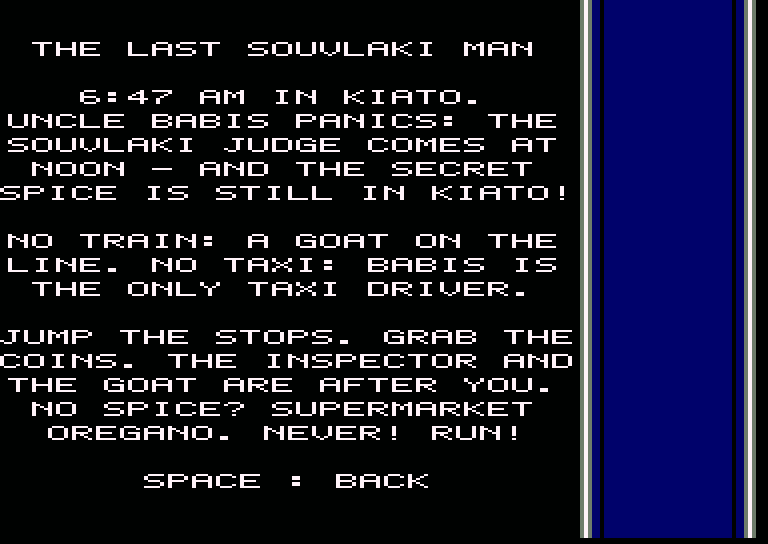

# Runner A.P.E.R

**Runner A.P.E.R** (*Athens Piraeus Electric Railways*) is a top-down endless runner for the **Amstrad CPC 6128**,
written in **Z80 assembly**.

Run along the three tracks of the electric railway, collect coins, jump over buffer stops, climb onto train roofs
from the ramps and watch out for red signals, from the city avenue all the way to the forest.

> **Status**: complete game (Phases 0–10). The check on a CPC 6128+ (CRTC 3/4) is still open. See [plan.md](plan.md)
> (in Greek) for the architecture and the progress.

**Player's manual:** [English](docs/manual_en.md) ([PDF](docs/manual_en.pdf)) ·
[Ελληνικά](docs/manual_el.md) ([PDF](docs/manual_el.pdf)) · **Disc cover:** [docs/cover](docs/cover/)

| | | |
|---|---|---|
|  |  |  |
|  |  |  |
|  |  |  |

---

## Features

- **Mode 0, 192×272 overscan**, 16 colours, smooth **vertical hardware scroll** (line by line), steady picture edges.
- A steady **25 fps**: practically no dropped frames, even at top speed.
- **3 difficulty levels**: EASY / MEDIUM / HARD (speed 4 / 5 / 6 lines per frame; on HARD you also jump the gaps
  between wagons). Obstacles start sparse and get denser over time, faster on the harder levels.
- **Side HUD** (1/4 of the screen) like a train's dashboard: score and best score, coins and lives, the route
  Kiato → Piraeus with the runner's place, all six power-ups (lit with a time bar while running), and a little
  track that scrolls with the world and shows the station boards going by.
- **Stations**: Corinth, Megara, Elefsina, Aspropyrgos, Rentis, Piraeus. Their names appear on the track as you pass
  them; Piraeus gives 1000 points and the route starts again.
- **3 railway tracks** with trains (3 wagon types, 3 locomotive types), ramps, buffer stops and signals.
- **Moving trains**: on the right track they come towards you, on the left one they run ahead of you, slower; the
  middle track's trains stand still (EASY: none move, MEDIUM: only the left track, HARD: both).
- **5 height levels**: the runner "grows" the higher he is, from the ground up to the highest jump above a train roof.
- **Environments**: city (a 3+3 lane avenue with cars, buses and kiosks) and forest, with **footbridges** and
  **road bridges** overhead.
- **Loading screen**, **menu**, **story**, **pause**, a **countdown** before every run, a **game over screen** with a
  high score table and 3-letter names, and a **demo** when you stay in the menu.
- **English and Greek** (switch with `L` in the menu).
- **AY sound** from the interrupt (50 times a second): three original tunes (game, menu, game over) and effects
  (coin, jump, power-up, crash, signal). Music and sound can be switched on and off separately.

## How to play

The runner is at the bottom of the screen and the track comes from the top. Change lane to avoid obstacles, jump to
clear them, and collect as many coins as you can. While you are in the air you pass **over** coins and power-ups
without taking them. Obstacles get denser the longer you run. You have **3 lives**.

### Controls

| Action | Keyboard | Joystick |
|---|---|---|
| Left lane | `←` or `O` | left |
| Right lane | `→` or `P` | right |
| Jump | `↑`, `Q` or `SPACE` | up / FIRE |
| Fast landing | `↓` or `A` | down |
| Pause | `H` | — |
| Music on/off | `M` | — |
| Back to the menu | `ESC` | — |
| Language (menu) | `L` | — |

### Heights

| Height | Meaning |
|---|---|
| 1 | On the ground |
| 2 | Jump from the ground: you clear buffer stops |
| 3 | On a train roof |
| 4 | Jump over a train / from the roof |
| 5 | The highest jump above a train |

### Pick-ups

One power-up every 50–150 rows, always with 8 clear rows around it (some on the train roofs, reached by the ramps);
its name is written on the track.

| Item | Effect |
|---|---|
| 🪙 Coin | +points |
| ⏩ Turbo | Faster (+2 lines per frame), distance counts double; the most common (30%) |
| 🐢 Slow | Half speed for a while |
| 🧲 Magnet | Pulls in the coins of the neighbouring lanes |
| 🦘 Super jump | From the ground over trains |
| ⛑️ Helmet | A shield for one crash |
| 🎫 2× coins | Coins are worth double |

### Obstacles

| Obstacle | How to get past |
|---|---|
| Wagon | Change lane, climb a ramp or jump with the super jump |
| Gap between wagons | HARD only: jump it while running on the roofs |
| Locomotive (front) | Never meet one head-on at ground level! |
| Oncoming train (right track) | Get out of its way: it comes at you faster than the track |
| Train ahead (left track) | Runs the same way, slower: you catch up with its back end |
| Ramp | Takes you up onto the roof / back down |
| Buffer stop | Jump or change lane |
| Signal | Green: go on. Red: change lane |

### Score
`score = distance (× 2 with Turbo) + coins × 10 (× 2 with 2× coins)`. The 8 best scores go into the high score table,
which is **saved to the disc** (file `SCORES`), so the disc must not be write-protected.

---

## Requirements

- An **Amstrad CPC 6128** (128K) or an emulator.
- To build:
  - [rasm](https://github.com/EdouardBERGE/rasm): assembler (v3.2.5+, on the `PATH`)
  - [iDSK](https://github.com/cpcsdk/idsk): disc image tool (`~/idsk/iDSK`)
  - [Caprice32](https://github.com/ColinPitrat/caprice32): emulator (snap: `caprice32.launcher`)
  - Python 3 + Pillow: graphics and track converters (`tools/`)
  - `~/cpcemu`: headless emulator for the automated tests
  - Microsoft Edge (Windows, from WSL): the PDF manuals and the cover (`make docs`)

## Build & run

```bash
make            # graphics + tracks + assembly -> build/runner.dsk
```

```bash
make run        # open in Caprice32 with an automatic RUN"RUNNER
```

```bash
make test       # headless tests with cpcemu
```

```bash
make screenshots    # docs/screenshots/*.png from the headless emulator
```

```bash
make docs       # docs/manual_*.pdf and the disc cover (docs/cover/)
```

By hand:

```bash
caprice32.launcher '--autocmd=run"disc' "$PWD/build/runner.dsk"
```

On a real CPC 6128: write `runner.dsk` to a disc (e.g. HxC/Gotek) and type `RUN"RUNNER`: the REVIVE8BIT screen
(`assets/revive8b.scr`) first, then the game after SPACE or 10 seconds. `RUN"DISC` goes straight to the game.
128K is required (the graphics, the sound and the texts live in banks C4–C7).

## Layout

```
src/       Z80 code (rasm)
gfx/       Aseprite graphics and PNG exports
assets/    loading screen (painted art, Blender scene)
levels/    track chunks as text (see tools/mklevel.py for the format)
music/     tunes and sound effects as text (see tools/mkmusic.py)
text/      screen texts, English and Greek (tools/mktext.py)
tools/     converters (png2cpc, scr2cpc, mklevel, mkmusic, mktext, art2loading), docs, screenshots and tests
docs/      manuals (EN/EL, Markdown and PDF), disc cover, screenshots
prompts/   prompts for the Aseprite MCP and the Blender MCP
build/     generated files (.dsk, .sym)
```

## Graphics

- [prompts/aseprite_graphics.md](prompts/aseprite_graphics.md): all tiles, sprites, fonts and screens.
- [prompts/blender_loading_screen.md](prompts/blender_loading_screen.md): the loading screen.

## Thanks

Inspired by the Athens–Piraeus electric railway (Line 1).
