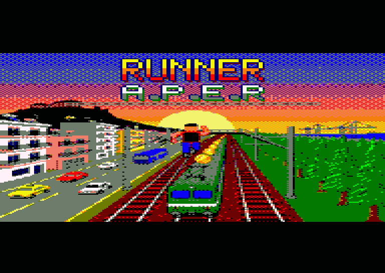
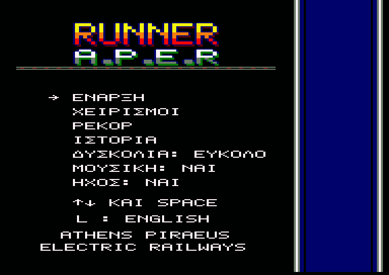
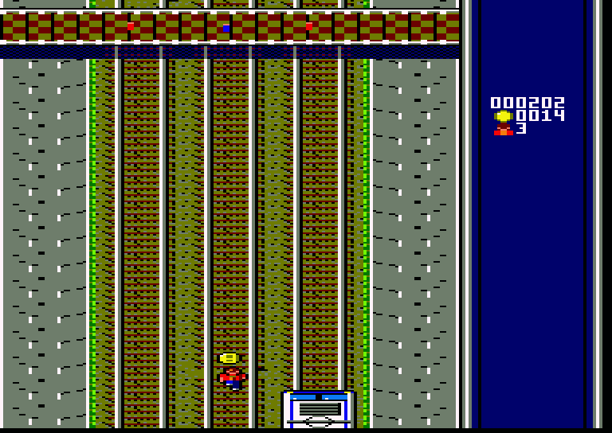
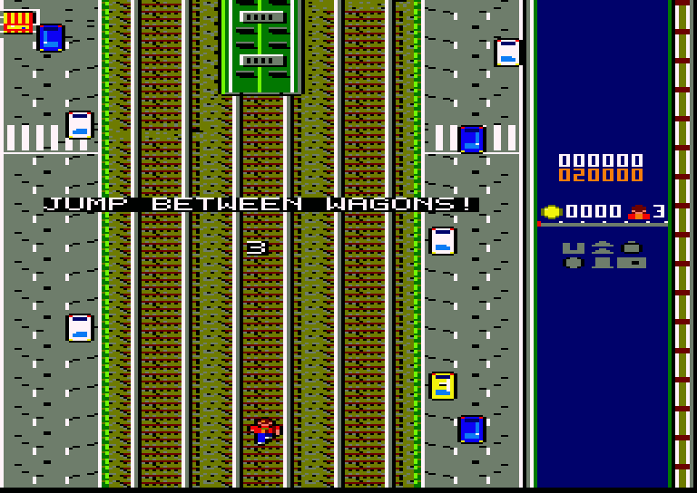
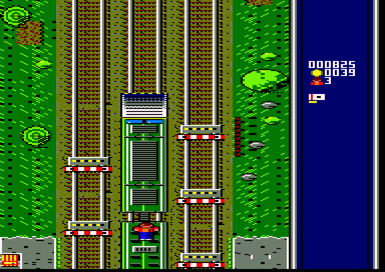
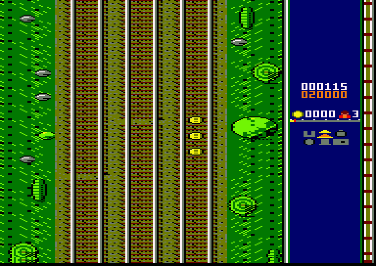
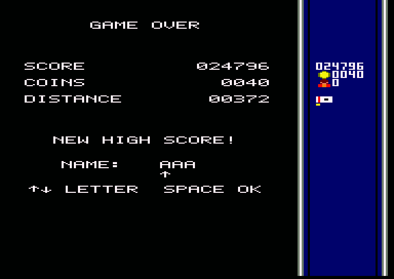

# RUNNER A.P.E.R

## Εγχειρίδιο παίκτη

*Ηλεκτρικοί Σιδηρόδρομοι Αθηνών–Πειραιώς* · για Amstrad CPC 6128 · δισκέτα



---

## Φόρτωση

1. Άνοιξε τον Amstrad CPC 6128 (χρειάζονται 128K).
2. Βάλε τη δισκέτα **RUNNER**, πλευρά A, στον οδηγό.
3. Γράψε `RUN"RUNNER` και πάτα **RETURN**. (Δουλεύει και το `RUN"DISC`.)

Πρώτα εμφανίζεται η οθόνη της REVIVE8BIT: πάτα **SPACE** για να συνεχίσεις ή περίμενε 10 δευτερόλεπτα. Μετά
εμφανίζεται η οθόνη φόρτωσης όσο φορτώνει το παιχνίδι. Σε λίγα δευτερόλεπτα βγαίνει το κεντρικό μενού.

> Τα ρεκόρ σου σώζονται στη δισκέτα. **Μην** την προστατεύσεις από εγγραφή αν θέλεις να κρατήσεις τα ρεκόρ σου.

---

## Η ιστορία: Ο τελευταίος σουβλατζής

Είναι 6:47 το πρωί στο Κιάτο. Ο θείος σου ο Μπάμπης, ο καλύτερος σουβλατζής του Πειραιά, σε πήρε τηλέφωνο
αλαφιασμένος. Σήμερα στις 12:00 έρχεται ο κριτής του «Χρυσού Καλαμακιού», και ο Μπάμπης έχει ξεχάσει στο Κιάτο το
μυστικό μπαχαρικό της γιαγιάς: ένα βαζάκι με ετικέτα «ΜΗΝ ΤΟ ΑΓΓΙΞΕΙΣ, ΜΠΑΜΠΗ».

Πήγες να πάρεις τον προαστιακό. Η αμαξοστοιχία όμως ακυρώθηκε λόγω «απρόβλεπτης παρουσίας κατσίκας στη γραμμή».
Ταξί δεν υπάρχει, γιατί ο μόνος ταξιτζής του Κιάτου είναι ο ίδιος ο Μπάμπης.

Έτσι τρέχεις στις ράγες με το βαζάκι στην τσέπη. Πηδάς τα στοπ. Ανεβαίνεις στις οροφές των τρένων που, παραδόξως,
κυκλοφορούν κανονικά για όλους εκτός από σένα. Μαζεύεις κέρματα για το εισιτήριο που δεν πρόλαβες να βγάλεις.

Ο ελεγκτής σε κυνηγάει από το Λουτράκι. Η κατσίκα επίσης.

Αν δεν φτάσεις, ο Μπάμπης θα βάλει στα καλαμάκια ρίγανη από το σούπερ μάρκετ. Και αυτό, στον Πειραιά, δεν
συγχωρείται ποτέ.

**ΤΡΕΞΕ!**

---

## Το κεντρικό μενού



Κινήσου με **↑ ↓** (ή το joystick) και διάλεξε με **SPACE**, **FIRE** ή **RETURN**.

| Επιλογή | Τι κάνει |
|---|---|
| ΕΝΑΡΞΗ | Ξεκινά ένα τρέξιμο |
| ΧΕΙΡΙΣΜΟΙ | Δείχνει τα πλήκτρα |
| ΡΕΚΟΡ | Οι 8 καλύτεροι δρομείς |
| ΙΣΤΟΡΙΑ | Γιατί στην ευχή τρέχεις |
| ΔΥΣΚΟΛΙΑ | ΕΥΚΟΛΟ / ΜΕΤΡΙΟ / ΔΥΣΚΟΛΟ |
| ΜΟΥΣΙΚΗ | Μουσική ναι ή όχι |
| ΗΧΟΣ | Όλος ο ήχος ναι ή όχι |

Με το **L** αλλάζεις ανάμεσα σε ελληνικά και αγγλικά. Αν αφήσεις το μενού για λίγο, το παιχνίδι δείχνει ένα **demo**.
Πάτα ένα πλήκτρο για να επιστρέψεις.

---

## Χειρισμοί

| Ενέργεια | Πληκτρολόγιο | Joystick |
|---|---|---|
| Μία γραμμή αριστερά | `←` ή `O` | αριστερά |
| Μία γραμμή δεξιά | `→` ή `P` | δεξιά |
| Άλμα | `↑`, `Q` ή `SPACE` | πάνω ή FIRE |
| Γρήγορη προσγείωση | `↓` ή `A` | κάτω |
| Παύση / συνέχεια | `H` | — |
| Μουσική ναι/όχι | `M` | — |
| Τα παρατάς, πίσω στο μενού | `ESC` | — |

---

## Το παιχνίδι



Τρέχεις στο κάτω μέρος της οθόνης και η γραμμή έρχεται προς τα πάνω σου. Υπάρχουν **τρεις γραμμές**. Άλλαξε γραμμή
για να αποφύγεις ό,τι έρχεται, πήδα για να το περάσεις και μάζεψε όσα κέρματα μπορείς. Όσο είσαι στον αέρα περνάς
**από πάνω** από κέρματα και power-ups χωρίς να τα παίρνεις, οπότε διάλεγε καλά πότε θα πηδήξεις.

Κάθε τρέξιμο ξεκινά με αντίστροφη μέτρηση: **3, 2, 1, ΠΑΜΕ!** Στο **ΔΥΣΚΟΛΟ** το παιχνίδι σε προειδοποιεί πρώτα ότι
πρέπει να πηδάς ανάμεσα στα βαγόνια.



Η γραμμή περνά μέσα από την **πόλη**, δίπλα σε μια λεωφόρο με κίνηση (κάποια αυτοκίνητα ξεκινούν
και φεύγουν: δεξιά ανεβαίνουν, αριστερά κατεβαίνουν), και βγαίνει στο **δάσος**. Από πάνω περνούν
πεζογέφυρες και γέφυρες αυτοκινήτων. Όσο περισσότερο τρέχεις, τόσο πιο πολλά εμπόδια έχουν οι γραμμές. Κάπου μετά
τα Μέγαρα πέφτει ο ήλιος: σούρουπο, μετά νύχτα, με φωτισμένα παράθυρα στα τρένα και σκοτεινό δάσος, και πιο κάτω ξημερώνει.



### Δυσκολία

| Επίπεδο | Ταχύτητα | Ιδιαιτερότητα |
|---|---|---|
| ΕΥΚΟΛΟ | κανονική | Τα εμπόδια πυκνώνουν αργά, ποτέ πάνω από 2 σε μία γραμμή μέσα σε μία οθόνη· τα τρένα στέκονται |
| ΜΕΤΡΙΟ | περίπου 20% πιο γρήγορα | Τα εμπόδια πυκνώνουν πιο γρήγορα· κινούνται τα τρένα της αριστερής γραμμής |
| ΔΥΣΚΟΛΟ | ακόμα πιο γρήγορα | Κινούνται τα τρένα και των δύο πλαϊνών γραμμών, και πρέπει να **πηδάς τα κενά ανάμεσα στα βαγόνια** όταν τρέχεις στις οροφές |

### Ύψη

Ο δρομέας μεγαλώνει στην οθόνη όσο πιο ψηλά βρίσκεται.

| Ύψος | Πού είσαι |
|---|---|
| 1 | Στο έδαφος |
| 2 | Άλμα από το έδαφος: περνάς τα στοπ |
| 3 | Στην οροφή του τρένου |
| 4 | Άλμα στην οροφή, πάνω από τα βαγόνια |
| 5 | Το ψηλότερο άλμα πάνω από τρένο |

### Ζωές

Έχεις **3 ζωές**. Μετά από σύγκρουση είσαι προστατευμένος για λίγο. Όταν χαθεί η τελευταία ζωή, το παιχνίδι τελειώνει.

---

## Η οθόνη

Η γραμμή πιάνει τα τρία τέταρτα της οθόνης. Το πάνελ στα δεξιά είναι το ταμπλό του τρένου:

- το **σκορ** σου (λευκό) και το **καλύτερο σκορ** (πορτοκαλί)·
- τα **κέρματα** και οι **ζωές** που μένουν·
- η **διαδρομή** από το Κιάτο στον Πειραιά: το κίτρινο κομμάτι το πέρασες, το κόκκινο σημάδι είσαι εσύ·
- και τα έξι **power-ups**: γκρι όταν δεν τα έχεις, αναμμένα με μπάρα χρόνου όσο κρατούν·
- δεξιά, μια μικρή **γραμμή** που τρέχει μαζί σου: πάνω της περνούν οι πινακίδες των σταθμών.

## Η διαδρομή

Τρέχεις από το Κιάτο στον Πειραιά: **Κόρινθος, Μέγαρα, Ελευσίνα, Ασπρόπυργος, Ρέντης, Πειραιάς**. Όταν περνάς έναν
σταθμό χτυπά το καμπανάκι και το όνομά του γράφεται στη γραμμή. **Ο Πειραιάς δίνει 1000 πόντους** και η διαδρομή
ξαναρχίζει.

---

## Power-ups

Ένα power-up εμφανίζεται κάθε 50 με 150 σειρές, ποτέ ακριβώς μπροστά από εμπόδιο. Μερικά είναι πάνω στις οροφές
των τρένων: ανέβα από τη ράμπα για να τα πάρεις. Όταν το πάρεις, το όνομά του
γράφεται στη μέση της οθόνης.



| Power-up | Τι κάνει | Διάρκεια |
|---|---|---|
| Κέρμα | 10 πόντοι | — |
| ΤΟΥΡΜΠΟ | 2 γραμμές ανά frame πιο γρήγορα, η απόσταση μετράει διπλή (το πιο συχνό) | 8 δλ. |
| ΑΡΓΑ | Μισή ταχύτητα: μια ανάσα | 8 δλ. |
| ΜΑΓΝΗΤΗΣ | Τραβάει τα κέρματα των διπλανών γραμμών | 10 δλ. |
| ΥΠΕΡΑΛΜΑ | Από το έδαφος πηδάς πάνω από τρένο | 10 δλ. |
| ΚΡΑΝΟΣ | Σε σώζει από μία σύγκρουση | ως το χτύπημα |
| 2Χ ΚΕΡΜΑΤΑ | Κάθε κέρμα μετράει διπλό | 15 δλ. |

Το ΤΟΥΡΜΠΟ και το ΑΡΓΑ ακυρώνουν το ένα το άλλο.

---

## Εμπόδια

| Εμπόδιο | Πώς το περνάς |
|---|---|
| Βαγόνι | Άλλαξε γραμμή, ανέβα από ράμπα ή χρησιμοποίησε το ΥΠΕΡΑΛΜΑ |
| Κενό ανάμεσα σε βαγόνια | Μόνο στο ΔΥΣΚΟΛΟ: πήδα το όταν τρέχεις στις οροφές |
| Μηχανή | Μην τη συναντήσεις από μπροστά στο έδαφος! |
| Τρένο που έρχεται | Στη δεξιά γραμμή (ΔΥΣΚΟΛΟ): έρχεται καταπάνω σου πιο γρήγορα από τη γραμμή· φύγε από μπροστά του |
| Τρένο που φεύγει | Στην αριστερή γραμμή (ΜΕΤΡΙΟ και ΔΥΣΚΟΛΟ): πάει προς την ίδια μεριά, πιο αργά, και φτάνεις το πίσω άκρο του |
| Ράμπα | Σε ανεβάζει στην οροφή· στο τέλος του τρένου κατεβαίνεις |
| Στοπ | Πήδα το ή άλλαξε γραμμή |
| Φανάρι | Πράσινο: συνεχίζεις. Κόκκινο: άλλαξε γραμμή, γρήγορα |

Το καμπανάκι χτυπά όταν ένα φανάρι μπροστά σου γίνεται κόκκινο.

---

## Σκορ και ρεκόρ

```
σκορ = απόσταση (x2 με ΤΟΥΡΜΠΟ) + κέρματα x 10 (x2 με 2Χ ΚΕΡΜΑΤΑ)
```

Αν το σκορ σου μπει στα 8 καλύτερα, γράψε τα αρχικά σου: με **↑ ↓** διαλέγεις γράμμα και με **SPACE** το κρατάς.
Ο πίνακας σώζεται στη δισκέτα, οπότε τα ρεκόρ είναι εκεί και την επόμενη φορά.



---

## Συμβουλές

- Κέρματα πάνω σε τρένο σημαίνουν ότι κάπου κοντά έχει ράμπα: ανέβα και μάζεψέ τα.
- Μην πηδάς πολύ νωρίς: στον αέρα χάνεις τα κέρματα.
- Κράτα το ΚΡΑΝΟΣ για τα δύσκολα κομμάτια. Χάνεται στην πρώτη σύγκρουση.
- Το ΑΡΓΑ είναι φίλος σου στο ΔΥΣΚΟΛΟ όταν οι γραμμές γεμίζουν.
- Κοίτα τα φανάρια από μακριά: ένα κόκκινο σου αφήνει λίγο χρόνο.

---

## Συντελεστές

**REVIVE8BIT · 2026 · VASPER**

Runner A.P.E.R: κώδικας Z80, γραφικά, μουσική και ιστορία γραμμένα για τον Amstrad CPC 6128.
Εμπνευσμένο από τον ηλεκτρικό σιδηρόδρομο Αθηνών–Πειραιώς (Γραμμή 1).

*Καμία κατσίκα δεν έπαθε κακό κατά τη δημιουργία αυτού του παιχνιδιού.*
