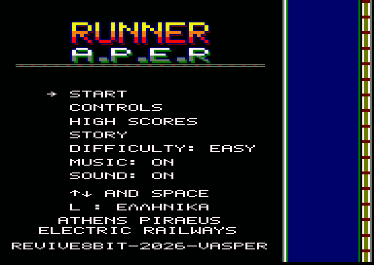

# RUNNER A.P.E.R

## Player's Manual

*Athens Piraeus Electric Railways* · for the Amstrad CPC 6128 · disc


---

## Loading

1. Switch on your Amstrad CPC 6128 (128K is required).
2. Insert the **RUNNER** disc, side A, into the drive.
3. Type `RUN"RUNNER` and press **RETURN**. (`RUN"DISC` works too.)

First the REVIVE8BIT screen appears: press **SPACE** to go on, or wait 10 seconds. Then the loading screen appears while
the game loads. After a few seconds the main menu comes up.

> Your high scores are saved on the disc. Do **not** write-protect it if you want to keep your records.

---

## The story: The Last Souvlaki Man

It's 6:47 a.m. in Kiato. Your uncle Babis, the finest souvlaki man in Piraeus, has just called you in a total panic.
At noon the judge of the "Golden Skewer" contest arrives at his shop, and Babis has left Grandma's secret spice in
Kiato: a little jar labelled "DO NOT TOUCH, BABIS".

You head for the suburban train. It's cancelled "due to the unforeseen presence of a goat on the line". There's no
taxi either, because the only taxi driver in Kiato is Babis himself.

So you run along the tracks with the jar in your pocket. You jump the buffer stops. You climb onto the roofs of
trains that, strangely, run perfectly on time for everyone except you. You grab coins for the ticket you never had
time to buy.

The ticket inspector has been chasing you since Loutraki. So has the goat.

If you don't make it, Babis will season the skewers with supermarket oregano. In Piraeus, that is never forgiven.

**RUN!**

---

## The main menu



Move with **↑ ↓** (or the joystick) and choose with **SPACE**, **FIRE** or **RETURN**.

| Option | What it does |
|---|---|
| START | Starts a run |
| CONTROLS | Shows the keys |
| HIGH SCORES | The 8 best runners |
| STORY | Why on earth you are running |
| DIFFICULTY | EASY / MEDIUM / HARD |
| MUSIC | Tunes on or off |
| SOUND | All sound on or off |

Press **L** to switch between English and Greek. If you leave the menu alone for a while, the game shows a **demo**;
press any key to come back.


---

## Controls

| Action | Keyboard | Joystick |
|---|---|---|
| Move one lane left | `←` or `O` | left |
| Move one lane right | `→` or `P` | right |
| Jump | `↑`, `Q` or `SPACE` | up or FIRE |
| Land quickly | `↓` or `A` | down |
| Pause / continue | `H` | — |
| Music on/off | `M` | — |
| Give up, back to the menu | `ESC` | — |

---

## Playing the game


You run at the bottom of the screen and the line comes towards you from the top. There are **three tracks**. Change
lane to dodge what is ahead, jump to clear it, and pick up every coin you can. While you are in the air you fly
**over** coins and power-ups and don't collect them, so time your jumps.

Every run starts with a countdown: **3, 2, 1, GO!** On **HARD** the game first warns you to jump between the wagons.


The line runs through the **city**, beside a busy avenue (some cars pull out and drive off:
up on the right, down on the left), and out into the **forest**. Footbridges and road bridges
pass overhead. The longer you run, the more crowded the tracks get. Somewhere after Megara the sun sets: dusk,
then night, with lit train windows and a dark forest, and dawn again further down the line.


### Difficulty

| Level | Speed | Special |
|---|---|---|
| EASY | normal | Obstacles get denser slowly, never more than 2 on one track in a screen; trains stand still |
| MEDIUM | about 20% faster | Obstacles get denser faster; trains move on the left track |
| HARD | faster still | Trains move on both side tracks, and you must **jump the gaps between wagons** when you run on the roofs |

### Heights

The runner gets bigger on screen the higher he is.

| Height | Where you are |
|---|---|
| 1 | On the ground |
| 2 | Jumping from the ground: clears buffer stops |
| 3 | On a train roof |
| 4 | Jumping on a roof, over the wagons |
| 5 | The highest jump above a train |

### Lives

You have **3 lives**. After a crash you are protected for a moment. When the last life is gone, the game is over.

---

## The screen

The track takes up three quarters of the screen. The panel on the right is the train's dashboard:

- your **score** (white) and the **best score** (orange);
- your **coins** and the **lives** left;
- the **route** from Kiato to Piraeus: the yellow stretch is behind you, the red mark is you;
- all six **power-ups**: grey when you don't have them, lit with a time bar while they run;
- on the right, a little **track** that runs with you: the station boards go by on it.

## The route

You run from Kiato to Piraeus: **Corinth, Megara, Elefsina, Aspropyrgos, Rentis, Piraeus**. The bell rings and the
station's name appears on the track as you pass it, with its platforms on either side of you (benches, a red
canopy with blue name boards). **Piraeus gives 1000 points**, and then the route starts again.

---

## Power-ups

A power-up turns up every 50 to 150 rows, never right in front of an obstacle. Some sit on the train roofs:
take the ramp to reach them. When you take one, its name appears in
the middle of the screen.


| Power-up | Effect | Lasts |
|---|---|---|
| Coin | 10 points | — |
| TURBO | 2 lines per frame faster, distance counts double (the most common) | 8 s |
| SLOW | Half speed: a breather | 8 s |
| MAGNET | Pulls in the coins of the lanes next to you | 10 s |
| SUPER JUMP | Jump from the ground right over a train | 10 s |
| HELMET | Saves you from one crash | until hit |
| 2X COINS | Every coin is worth double | 15 s |

TURBO and SLOW cancel each other.

---

## Obstacles

| Obstacle | How to get past |
|---|---|
| Wagon | Change lane, run up a ramp, or use the SUPER JUMP |
| Gap between wagons | On HARD only: jump it when you run on the roofs |
| Locomotive | Don't meet one head-on at ground level! |
| Oncoming train | On the right track (HARD): it comes at you faster than the track; get out of its way |
| Train ahead | On the left track (MEDIUM and HARD): it runs your way, slower, and you catch up with its back end |
| Ramp | Takes you up onto the roof; the end of the train takes you back down |
| Buffer stop | Jump it or change lane |
| Signal | Green: go on. Red: change lane, fast |

The signal bell rings when a signal ahead turns red.

---

## Scoring and high scores

```
score = distance (x2 with TURBO) + coins x 10 (x2 with 2X COINS)
```

If your score makes the top 8, type your initials: **↑ ↓** choose a letter, **SPACE** accepts it. The table is saved
on the disc, so the records are still there next time.


---

## Hints and tips

- Coins on a train roof mean a ramp is near: go up and collect them.
- Don't jump too early: in the air you miss the coins.
- Keep the HELMET for the crowded stretches. It is used up on the first crash.
- SLOW is your friend on HARD when the tracks get full.
- Watch the signals from far away: a red light leaves you little time.

---

## Credits

**REVIVE8BIT · 2026 · VASPER**

Runner A.P.E.R: Z80 code, graphics, music and story written for the Amstrad CPC 6128.
Inspired by the Athens–Piraeus electric railway (Line 1).

*No goats were harmed in the making of this game.*
